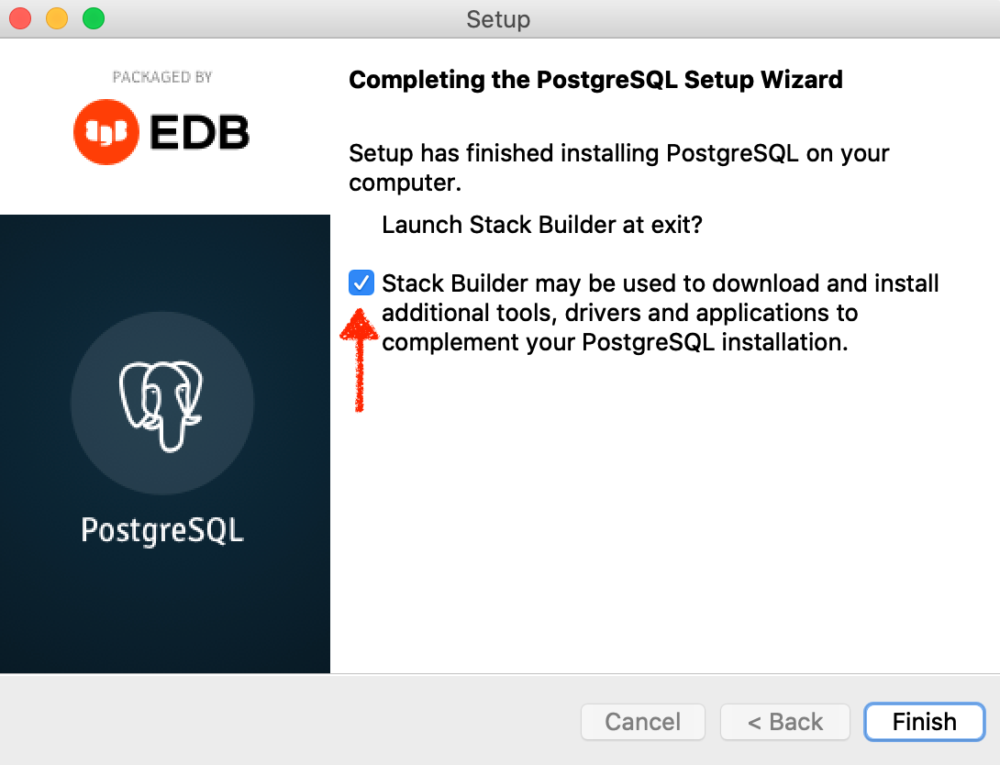

يحوي هذا المخزن المستلزمات التي يحتاجها المشاهدون لقائمة اليوتيوب التعليمية لتقنية الپوست جي آي إس أدناه

https://www.youtube.com/watch?v=_6M1zw3EHvc&list=PLLqQGhR49nBo106c4tQZQPiaG5gQZjrpD

لتحميل برنامج
PGAdmin

١. تنزيل النسخة المناسبة لنظام التشغيل من الرابط

https://www.enterprisedb.com/downloads/postgres-postgresql-downloads

---
٢.عند تشغيل برنامج التحميل ستظهر لك شاشة مشابهة للشاشةالآتية ، قم بالضغط على نكست

---
٣. في هذه الشاشة يمكنك اختيار مجلد البرنامج ، ينصح بترك المجلد الافتراضي والضغط على نكست

---
٤. هذه قائمة المحتويات المفترض إنزالها ، ينصح أيضا بعدم تغيير الاختيارات والضغط على نكست

---
٥. وهذا المجلد لتخزين البيانات، انصح أيضا بترك الاختيار الافتراضي وضغط نكست

---
٦. في هذه الشاشة ادخل كلمة السر للمستخدم الرئيس لقاعدة البيانات
`postgres`
وبعدها اضغط على نكست

---
٧. هذه الشاشة تعرض رقم الپورت المستخدم ، أيضا من الأفضل ترك الپورت الافتراضي والضغط على نكست

---
٨. هذه القائمة تتضمن المعايير اللغوية ، الاختيار الافتراضي يستخدم معايير اللغة من نظامك التشغيلي ، قم بالضغط على نكست

---
٩. في هذه الشاشة ملخص الاختيارات السابقة للتأكد قبل البدأ بتنزيل البرنامج ، قم بالمراجعة ومن ثم الضغط على نكست

---
١٠. هذه شاشة تأكيدية لموافقتك على تنزيل البرنامج ، اضغط على نكست

---
١١. هذه الشاشة تعرض إنزال البرنامج ، بعد الانتهاء اضغط على نكست

---
١٢. قم بترك الاختيار والضغط على نكست لتنزيل الامتداد الجغرافي لقاعدة البيانات

---
١٣. قم باختيار قاعدة البيانات التي ترغب بإمدامها بالامتداد الجغرافي ثم اضغط على نكست

---
١٤. اختر الپوست جي آي إس من القائمة كما هو موضح ثم اضغط على نكست

---
١٥. هذه الشاشة للتأكيد على اختيارك ، اضغط نكست 

---
١٦. الآن سيقوم البرنامج بربط قاعدة البيانات بالامتداد الجغرافي ، اضغط نكست وستظهر لك شاشات لربط الامتداد الجغرافي ، قم باختيار نكست في كل مرة

---
١٧. هذه الشاشة الأخيرة ، اضغط على فينيش

---

الملف المرفق
`city_country.sql`
يمكن استخدامه لإضافة جدولين لقاعدة البيانات
